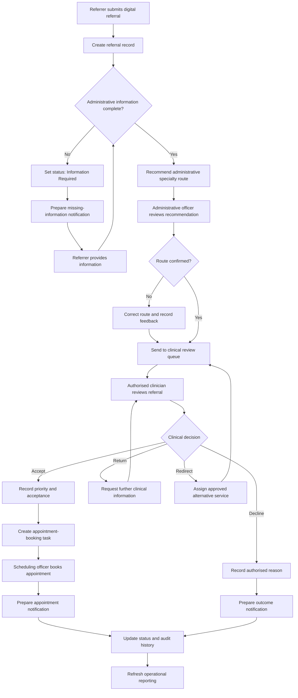

# TO-BE Outpatient Referral Process Analysis

## Purpose

This document describes the proposed future-state outpatient referral process
for the fictional BrightCare Health organisation using the CarePath concept.

The TO-BE process standardises referral submission, validates administrative
completeness, supports administrative routing, preserves human-controlled
clinical decisions and improves status visibility, auditability and reporting.

## Future-State Process Principles

- Referrals are submitted through a standard digital form.
- Mandatory administrative information is validated before clinical review.
- AI may recommend an administrative route but cannot make a final clinical
  decision.
- Authorised clinical staff determine suitability, acceptance and urgency.
- Every status change and user action is recorded in an audit history.
- Notifications are prepared from approved templates and reviewed where
  required.
- The prototype uses synthetic data only.

## TO-BE Process Flow

The detailed, implementation-oriented flowchart is available in
[TO-BE Process Flowchart](./TO-BE-Process-Flowchart.md).

## Future-State Process Steps

| Step | Actor or System | Future-State Activity | Output | Control |
|---|---|---|---|---|
| 1 | Referring Clinician | Completes and submits the standard digital referral form | Submitted referral | Required fields and consent information are displayed clearly |
| 2 | CarePath | Generates a unique referral identifier and records the submission time | Referral record | Duplicate-detection rules flag possible repeated submissions |
| 3 | CarePath | Checks mandatory administrative fields and required documents | Completeness result | Validation checks administrative completeness only |
| 4 | CarePath | Identifies missing information when validation fails | Missing-information list | No clinical inference or diagnosis is performed |
| 5 | Referral Administration Officer | Reviews the missing-information result when required | Confirmed follow-up request | A human can correct the identified missing items |
| 6 | CarePath | Prepares a notification requesting the missing information | Draft notification | Approved template and minimum necessary information are used |
| 7 | Referring Clinician | Provides the missing information | Updated referral | Changes are timestamped and retained in audit history |
| 8 | CarePath | Revalidates the updated referral | Complete referral | The referral cannot proceed until required administrative fields are present |
| 9 | CarePath | Recommends an administrative specialty route using approved rules | Routing recommendation | Recommendation is explainable and does not determine clinical urgency |
| 10 | Referral Administration Officer | Confirms or corrects the recommended route | Confirmed specialty route | Corrections and reasons are recorded for review |
| 11 | CarePath | Places the referral in the relevant clinical-review queue | Clinical-review task | Access is limited to authorised roles |
| 12 | Clinical Review Nurse or Specialist Clinician | Reviews clinical suitability, urgency and supporting information | Human clinical decision | CarePath cannot approve, decline or prioritise independently |
| 13 | Clinical Reviewer | Accepts, returns, redirects or declines the referral | Recorded referral outcome | Decision, reason, reviewer and timestamp are recorded |
| 14 | CarePath | Creates an appointment-booking task for an accepted referral | Scheduling task | Task is created only after authorised acceptance |
| 15 | Appointment Scheduling Officer | Selects an appropriate available appointment | Appointment booking | Scheduling follows approved service rules and availability |
| 16 | CarePath | Prepares the relevant status or appointment notification | Draft notification | Communication is based on the authorised outcome |
| 17 | CarePath | Updates the referral status and audit history | Current referral record | Every material change is timestamped |
| 18 | Power BI | Refreshes operational measures using approved referral data | Operational dashboard | Reporting uses role-based access and minimum necessary fields |

## Decision Points

### Decision 1: Is the referral administratively complete?

- **Yes:** Continue to administrative routing.
- **No:** Set the status to `Information Required`, prepare a follow-up draft
  and wait for updated information.

### Decision 2: Is the recommended administrative route correct?

- **Yes:** Confirm the route and send the referral to the clinical-review queue.
- **No:** The administration officer selects the correct route and records the
  reason for the correction.

The corrected decision may be analysed later to improve the routing rules, but
it must not automatically change a production model.

### Decision 3: What is the authorised clinical outcome?

The authorised clinical reviewer selects one of the following:

- **Accept:** Record the human-selected priority and create a booking task.
- **Return:** Request additional clinical information and retain the referral in
  the clinical-review process.
- **Redirect:** Assign the referral to an approved alternative service.
- **Decline:** Record the authorised reason and prepare an outcome notification.

## Referral Status Model

| Status | Meaning | Permitted Next Statuses |
|---|---|---|
| Submitted | Digital referral has been received | Validating |
| Validating | Administrative completeness checks are in progress | Information Required, Ready for Routing |
| Information Required | Additional information is required from the referrer | Validating, Cancelled |
| Ready for Routing | Administrative validation is complete | Awaiting Administrative Review |
| Awaiting Administrative Review | Routing recommendation requires confirmation | Awaiting Clinical Review |
| Awaiting Clinical Review | Referral is waiting for an authorised clinical decision | Information Required, Redirected, Accepted, Declined |
| Redirected | Referral has been assigned to another approved service | Awaiting Clinical Review |
| Accepted | Referral has been clinically accepted | Awaiting Appointment |
| Awaiting Appointment | Scheduling action is required | Appointment Booked |
| Appointment Booked | Appointment details have been recorded | Completed, Cancelled |
| Declined | Referral was declined by an authorised reviewer | Closed |
| Cancelled | Referral was cancelled with a recorded reason | Closed |
| Completed | Referral journey and associated appointment activity are complete | Closed |
| Closed | No further action is required | None |

## Exception Paths

### Possible Duplicate Referral

CarePath flags the possible duplicate for administrative review. It must not
delete or merge records automatically.

### Invalid or Unsupported Specialty

The referral is placed in an administrative-review queue. An authorised staff
member selects an approved destination or returns it to the referrer.

### Referrer Does Not Respond

The referral remains in `Information Required` until the defined follow-up
period expires. An authorised staff member decides whether to send another
notification, cancel or close the referral.

### No Appointment Available

The referral remains in `Awaiting Appointment` and is displayed in the service
backlog. It is not silently closed or reprioritised.

### Notification Failure

The failed communication is recorded, and a task is created for staff follow-up.
The referral decision and booking remain unchanged.

## Roles and Responsibilities

| Role | Primary TO-BE Responsibility |
|---|---|
| Referring Clinician | Submit complete and accurate referral information and respond to follow-up requests |
| Referral Administration Officer | Review completeness exceptions, confirm routing and manage administrative queues |
| Clinical Review Nurse or Specialist Clinician | Make all clinical suitability, urgency, acceptance and decline decisions |
| Appointment Scheduling Officer | Book appointments and manage scheduling exceptions |
| Healthcare Operations Manager | Monitor workload, processing performance, waiting time and backlog |
| Privacy and Compliance Officer | Define privacy, retention, access and audit requirements |
| IT System Administrator | Manage access, configuration, availability and technical monitoring |
| Business Analyst | Maintain requirements, rules, process models and traceability |

## Audit Requirements

The audit history must record:

- Referral identifier.
- Previous and new status.
- Action performed.
- User or system actor.
- Date and time.
- Routing recommendation and confirmed route.
- Clinical decision and authorised reviewer.
- Reason for a correction, redirect, decline, cancellation or closure.
- Notification outcome.

The audit history should avoid storing unnecessary message content or duplicate
clinical information.

## Responsible AI Controls

- AI is limited to administrative assistance.
- Clinical decisions require an authorised human reviewer.
- Recommendations must be distinguishable from confirmed decisions.
- Staff can override an administrative recommendation.
- Overrides and reasons are recorded for monitoring.
- Unsupported, ambiguous or unusual referrals are sent for manual review.
- The prototype uses synthetic data only.
- Model or rule changes require review, testing and approval before release.

## Smart Agile Hub Implementation Mapping

The TO-BE process is designed so it can be implemented later through Smart
Agile Hub without transferring clinical decision authority to an agent.

| Process Capability | Proposed Smart Agile Hub Component |
|---|---|
| Digital referral capture | Digital Intake Agent |
| Mandatory-field and document checking | Validation Agent |
| Administrative specialty recommendation | Routing Agent |
| Booking and follow-up task creation | Workflow Agent |
| Draft status and appointment communications | Notification Agent |
| Status, action and decision history | Audit Agent |
| Operational data preparation | Reporting Agent with Power BI |

The Smart Agile Hub implementation should begin with deterministic business
rules, synthetic referral records and human approval gates. More advanced AI
assistance should be considered only after the workflow, controls and audit
requirements have been validated.

## Expected Improvements

| Current-State Issue | Future-State Improvement |
|---|---|
| Inconsistent referral forms | Standard digital referral form |
| Manual completeness checking | Automated administrative validation with exception review |
| Repeated unstructured follow-up | Structured missing-information workflow and draft notification |
| Inconsistent routing | Explainable routing recommendation with human confirmation |
| Limited status visibility | Standard referral statuses and timestamped history |
| Disconnected clinical review and scheduling | Booking task created after authorised acceptance |
| Inconsistent communication records | Event-based notification tracking |
| Manual operational reporting | Standardised data prepared for Power BI reporting |

## Proposed Performance Measures

- Percentage of referrals complete at first submission.
- Average time from submission to administrative validation.
- Percentage of routing recommendations confirmed without correction.
- Average time awaiting clinical review.
- Percentage of referrals processed within the target timeframe.
- Average time from clinical acceptance to appointment booking.
- Number of referrals awaiting additional information.
- Number and age of referrals in each queue.
- Notification success and failure rate.
- Number of administrative recommendation overrides.

## Next Step

The next project activity is to define the functional and non-functional
requirements for the CarePath solution and trace them to the pain points,
future-state process steps and responsible AI controls.
