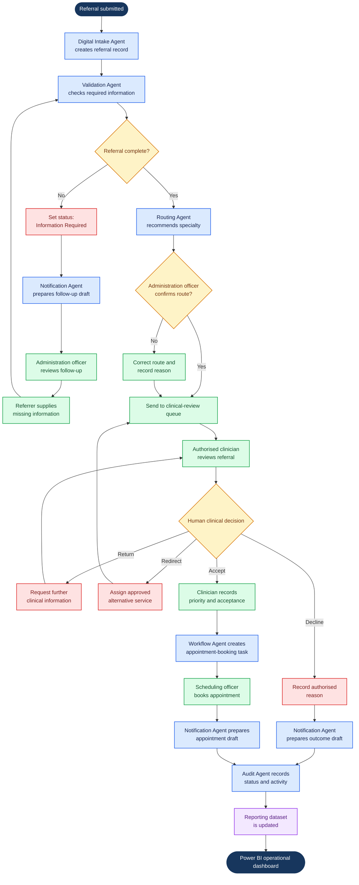

# CarePath TO-BE Process Flowchart

## Purpose

This flowchart presents the proposed CarePath outpatient referral process and
identifies the activities that can later be implemented through Smart Agile
Hub. All clinical decisions remain with authorised healthcare professionals.

## Flowchart Legend

| Colour | Meaning |
|---|---|
| Dark blue | Process start or final reporting output |
| Blue | Smart Agile Hub agent or automated workflow activity |
| Green | Human-controlled activity |
| Amber | Decision point |
| Red | Exception or alternative outcome |
| Purple | Reporting data activity |

## Human-Control Points

The following activities cannot be completed autonomously by Smart Agile Hub:

- Confirming or correcting the administrative route.
- Determining clinical suitability and urgency.
- Accepting, redirecting, returning or declining a referral.
- Selecting the final appointment.
- Approving communications where human review is required.

## Smart Agile Hub Agent Mapping

| Proposed Agent | Trigger | Main Responsibility | Human Control |
|---|---|---|---|
| Digital Intake Agent | New referral submission | Create the referral record, identifier and submission timestamp | Administration staff can review or correct captured information |
| Validation Agent | Referral created or updated | Check mandatory fields and supporting documents | Administration staff confirm exceptions and follow-up requirements |
| Routing Agent | Administrative validation completed | Recommend a specialty using approved administrative rules | Administration officer confirms or corrects the route |
| Workflow Agent | Authorised clinical decision recorded | Create the appropriate booking, follow-up or closure task | Clinical and scheduling staff retain decision ownership |
| Notification Agent | Information request, outcome or appointment event | Prepare an approved draft notification | Staff review when required before sending |
| Audit Agent | Material action or status change | Record actor, timestamp, old status, new status and reason | Audit records remain available for authorised review |
| Reporting Agent | Scheduled refresh or material update | Prepare operational data for Power BI | Operations manager interprets and acts on reports |

## Implementation Boundary

Smart Agile Hub supports the administrative workflow. It does not diagnose,
recommend treatment, make autonomous clinical-priority decisions or replace an
authorised clinical reviewer.

